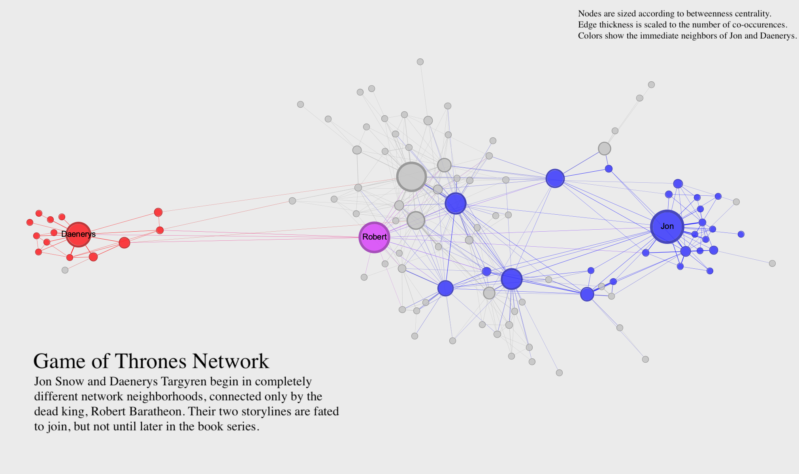

# Network Visualization

The practice of visualizing networks is a subset of the larger field of information visualization. As the authors of *The Network Turn* describe, network visualization and quantitative network analysis were developed as distinct approaches around the same time, and each approach informs the other. It's difficult to make quantitative arguments about networks without visualizations, and it's difficult to make visual arguments about networks without quantification. Here is a short guide to creating effective network visualizations.

## Visualization Resources

- [Gephi](https://gephi.org/): A tool for static network visualization that also allows you to calculate metrics and work with many different layouts.
- [Network Navigator](https://networknavigator.jrladd.com/): A drag-and-drop web tool for network metrics and visualization.
- [Palladio](http://hdlab.stanford.edu/palladio/): A drag-and-drop tool for data management and dynamic network visualization.
- [D3 Network Tutorial](https://observablehq.com/@jrladd/marvel-network): A tutorial for using the D3.js JavaScript library to create dynamic network visualizations.
- [Graphology Tutorial](https://observablehq.com/@jrladd/gotgraphology): A tutorial for using the Graphology JavaScript library to create dynamic visualizations.

## Static Visualization

Static network visualizations don't respond to the viewer's inputs, and they are typically single image files. They can be exploratory or explanatory, but in this class we will focus on creating *explanatory* visualizations that create a clear argument about a network. Here's an example:

This visualization uses the *Game of Thrones* network to make an argument about characters who co-occur in the *A Song of Ice and Fire* novels (on which the *Game of Thrones* TV series is based). The visualization uses clear labels, a readable layout, and a title, caption, and key to clearly communicate its argument. Rather than trying to show all aspects of the network, the visualization focuses in on just one thing. In static visualization, you may need to create more than one visualization if you have multiple aspects of the network you want to highlight.

You can visually adjust many different parts of a network to make a compelling visualization. Here's a list of some of the possibilities:

- **Layout**: The relative positions of nodes and edges can tell you a lot about the network and its parts. You can use a tabular or matrix layout to visualize a network without nodes and links. If you are using a classic node-link diagram like the one above, you can use irregular, regular, circular, rectilinear, or parallel layouts, and each one has different uses and highlights different things. In tools like Gephi, you also have access to a number of algorithmic layouts. We'll discuss all of these layout possibilities in class.
- **Nodes**: You can adjust node size to show a numerical value, node color to show a categorical or numerical value (using hue or brightness, respectively), and node position to indicate hierarchy, community, or change over time.
- **Edges**: You can adjust edge thickness to show a numerical value, edge color to show a categorical or numerical value, and edge arrows or curve to show direction.
- **Labels**: You can add labels to some or all of your nodes and edges to clearly indicate parts of your network. You can also use size and color with node labels in the same way you would use size and color of nodes. Sometimes, a network is most readable when you remove node circles entirely and use *only* labels.
- **Filters**: It's not always desirable to show the *entire* network. Some networks are very large and complex, and it might be helpful to filter down to a subset of nodes and edges in order to make an argument.

